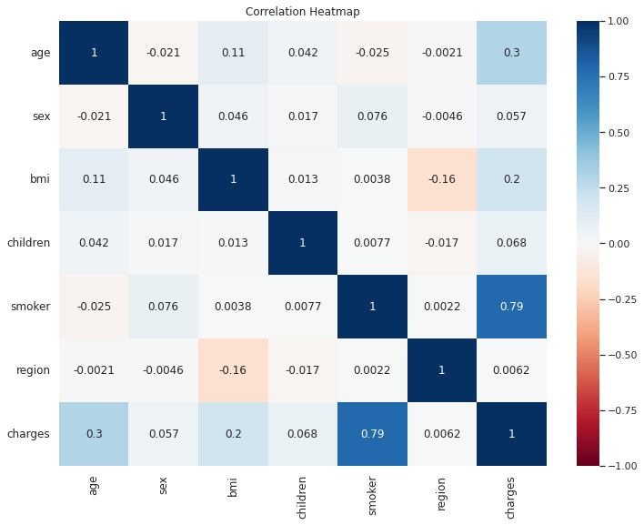
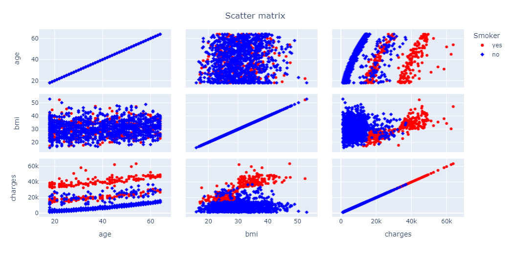
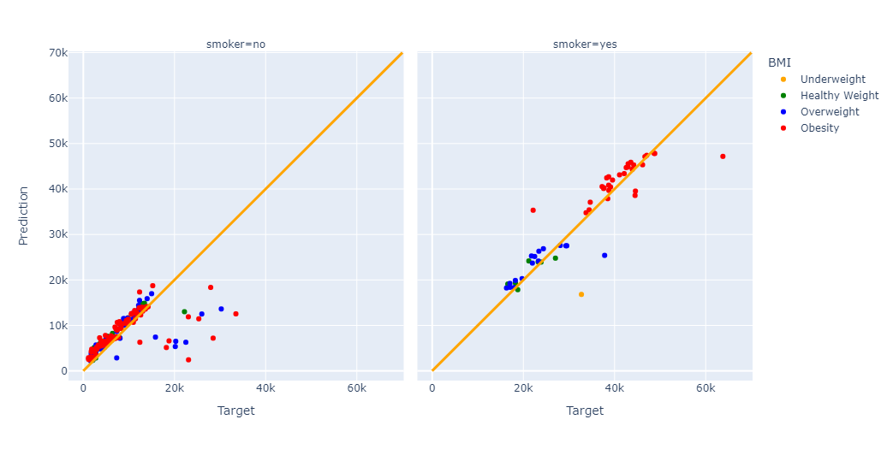

# Medical Cost

Medical costs are any expenses incurred for the prevention or treatment of disease or injury. Many things, such as prescriptions, and hospital visits, can be counted among medical costs. And the aim of this study is to discover which factors affect medical costs the most and to estimate medical costs by building a machine learning model.

## Data

* age : Age of primary beneficiary
* sex : Insurance contractor gender, female, male
* bmi : Body mass index, providing an understanding of body, weights that are relatively high or low relative to height, objective index of body weight (kg / m ^ 2) using the ratio of height to weight, ideally 18.5 to 24.9
* children : Number of children covered by health insurance / Number of dependents
* smoker : Smoking
* region : The beneficiary's residential area in the US, northeast, southeast, southwest, northwest.
* charges : Individual medical costs billed by health insurance

## Visual EDA

## Preprocessing data

* Categorical features such as sex, smoker, and region were simply encoded.
* The features that will not be used in the model have been dropped.

## Result

In general, I tried to show what was done in the project. If you want to examine it in more detail, <a href = 'https://www.kaggle.com/code/gokberkyucelkaya/medical-cost'>you can reach the notebook here.</a>
